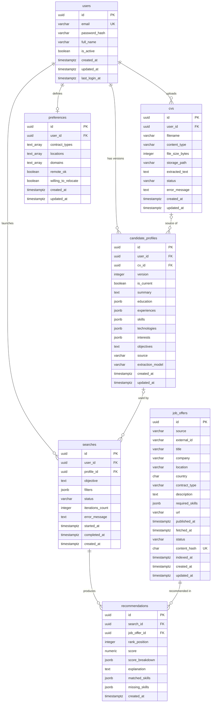

# Modèle de données

Version texte du modèle de données (US-2.1), lisible directement sur GitHub et modifiable avec un diff.
Le document complet (MCD, dictionnaire des colonnes, contraintes, traçabilité) est dans `modele-de-donnees-US-2.1.docx`.

## Schéma relationnel

## Contraintes d'unicité

| Table | Contrainte |
|---|---|
| `users` | `UNIQUE (email)` (email normalisé en minuscules) |
| `preferences` | `UNIQUE (user_id)` |
| `candidate_profiles` | `UNIQUE (user_id, version)` ; index unique partiel sur `(user_id)` `WHERE is_current` |
| `job_offers` | `UNIQUE (source, external_id)` ; `UNIQUE (content_hash)` |
| `recommendations` | `UNIQUE (search_id, job_offer_id)` ; `UNIQUE (search_id, rank_position)` |

## Suppressions (ON DELETE)

| Clé étrangère | Règle |
|---|---|
| `cvs.user_id`, `candidate_profiles.user_id`, `preferences.user_id`, `searches.user_id` | `CASCADE` |
| `recommendations.search_id` | `CASCADE` |
| `candidate_profiles.cv_id`, `searches.profile_id` | `SET NULL` |
| `recommendations.job_offer_id` | `RESTRICT` (une offre se passe en `expired`, elle ne se supprime pas) |

## Tables prévues plus tard

- `search_steps` : trace de chaque tour de la boucle de l'agent (US-7.8, 7.9, 7.12, 7.13)
- `offer_feedback` : offres sauvegardées ou rejetées (US-6.5, extension)
